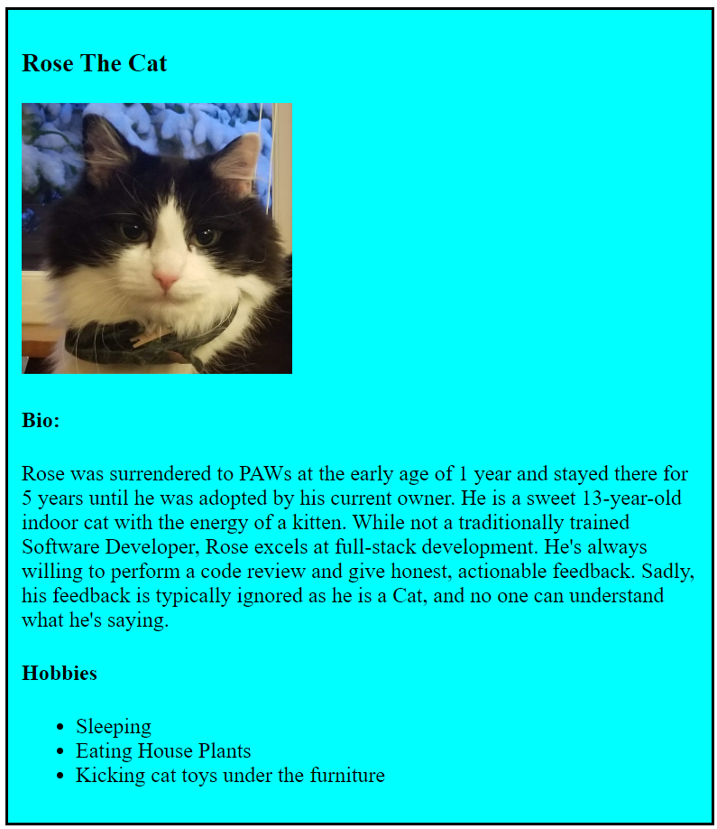

# Breakout Room Activity Week 1 Day 2
## Learning Goals 
- Review HTML and CSS 

Using the Card Div below as an example, create an info card for you and your teammates. It should include your name, an image, a short bio, and hobbies. 

Add some css of your choice to make it pretty! 

