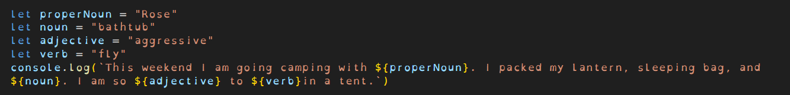

# Breakout Week 2 Day 2

## MadLibs

### Topics

- Intro to JavaScript
- Data Types
- Inputs and outputs

### Instructions

Madlibs is a word game, where Come you up with words that fit with the parts of speech listed on this page. Then fill in the matching blanks on the next page to create a nonsensical story!

- Create variables for the words
- Use string interpolation for the story
- Print the story to the console using console.log
- hit f12 to open dev tools. Click on the "Console" tab to see your code

#### Example

- Switch out the values of the variables to get different results!

# BE APPROPRIATE PLEASE

[Here are some example madlibs feel free to use any of them](https://www.thepaintedturtle.org/sites/main/files/file-attachments/mad_libs.pdf)
