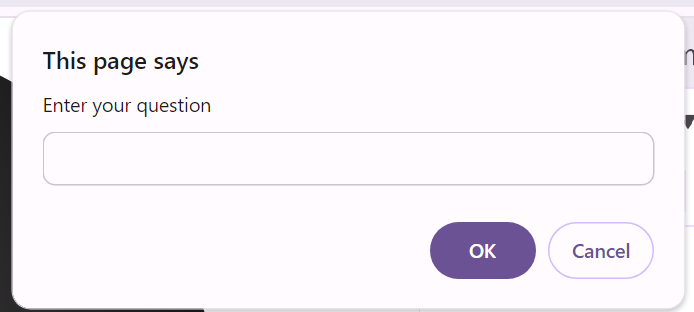

# Breakout Activity Week 3 day 1

## Topic

- Review JS
- Access the DOM

## Objectives: Students will be able to

- Create a function
- Call the function and pass it an argument
- Access the Dom with a querySelector
- Change text content on the DOM

## Needed Info

### prompt()

The prompt() method creates a popup box with a message and input.
The prompt() method will return the string input by the user.

```
let input = prompt("Enter your question")
console.log(input)
//The users input will print to the console.

```



### querySelector()

The querySelector method will traverse the DOM and return the first matching element

```
document.querySelector('img')
// Will return the first image on the DOM
```

## Deliverables

1. Use the prompt method to create a pop-up asking the user, "Welcome to food fast, where your food is delivered super fast. Can I take your order". Save the user input to a variable called "userResponse".

2. Create a function called placeOrder that takes an order as a parameter. Use if conditionals to respond to the user. If the user orders a Pizza, select the h2 element using quarySelector and update its Text content to say, "Your Total is $19.99". Otherwise, select the quarySelector and update the Text content to "Sorry we don't have [user input here]. Would you like a Pizza instead?"

3. Call placeOrder and pass it the variable userResponse.

4. Run the code by opening the HTML doc in the browser.

#### Stretch goals

5. Change the style color attribute on the order to something else.
6. Add a switch statement with a number of different orders.
7. Prompt the user for a drink order.
8. Calculate the users total order with drink and display it on the browser.
