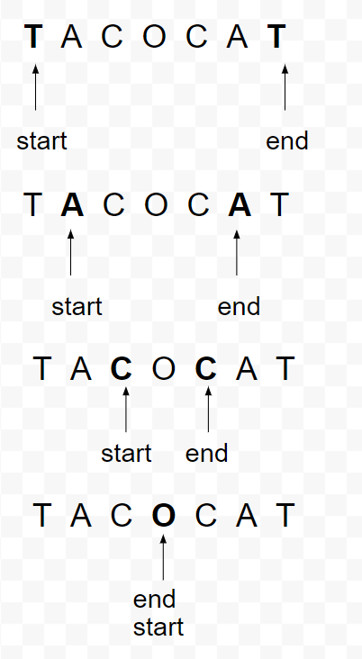
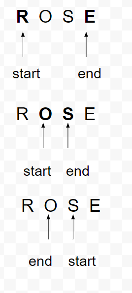

# Breakout Day 2

## Topics

- Loops

## Objectives: Students will be able to

[ ] Create a loop that iterates over a string
[ ] Compare two index points within a string

## Deliverables

A Palindrome is a word or sentence that reads the same backward and forwards tacocat, for example, reads the same forward or backward.
Complete the function in index.js that determines if a string is a Palindrome. The function should return true if the string is a palindrome, and false if it's not
Try to solve the problem first; if you get stuck, the solution is at the bottom of the index.js file.

### Palindrome

### Not A Palindrome

## Stretch Goals

- The function ignores white space. If implemented correctly, 'taco cat' would return true.
- Update the function to ignore letter case. 'Taco cat' would return true.
- Return false if the string is empty ""
- Return false if you receive a param that's not a string. For example 1001 should return false
